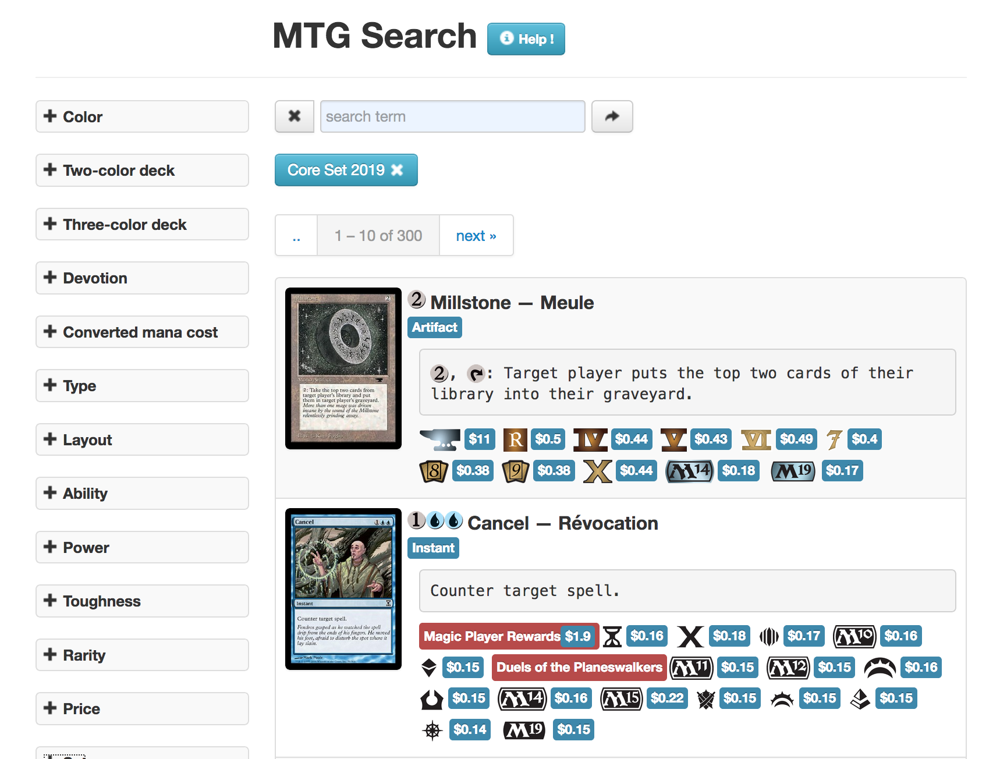
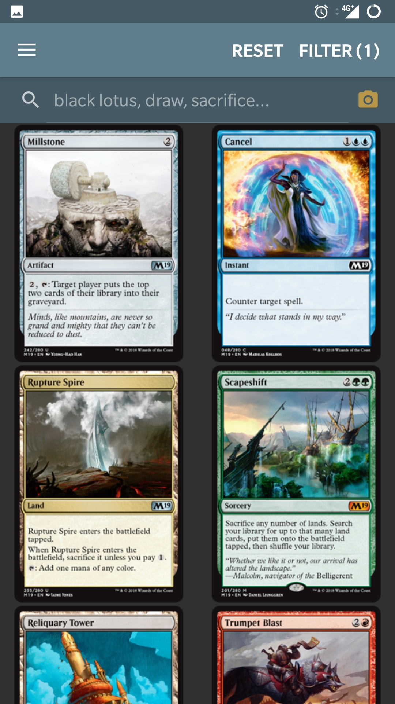

# MTG Search

Search engine for 18000+ Magic: The Gathering cards, using [mtgjson.com](https://mtgjson.com/) and aggregated with prices and card pictures.

## ⚙️  Backend

Cards are indexed into an elasticsearch instance, providing:
- full-text search
- faceted search
- autocomplete

## 🌐 Web

[mtg-search.com](http://mtg-search.com): using jquery [facetview](https://github.com/okfn/facetview) plugin to enable
- full-text search
- faceted search

## 🤖 Android

[Play Store](https://play.google.com/store/apps/details?id=mtg.magic.search.deck.builder)
- full-text search
- faceted search
- autocomplete keywords, cards, sets
- deck editor
- card scanner

